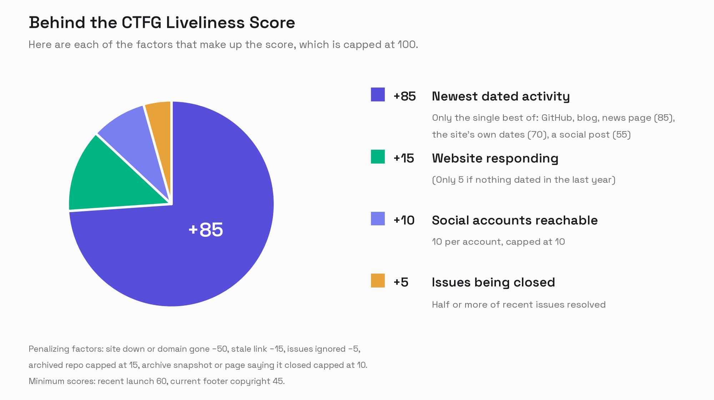

# liveliness

Works out whether a project is still alive from what it publishes: its website, its code repository, its feeds and its social accounts. Returns a score from 0 to 100 and the reasoning that produced it.

This is the algorithm behind the activity scores on the [Civic Tech Field Guide](https://civictech.guide), published so anyone can read it, run it on their own data, and suggest improvements. The directory it was built for is not in here. What is in here is how a project gets judged.

## Why the reasoning comes back with the score

A number on its own cannot be argued with. If a project is marked inactive and disagrees, the useful answer is the specific thing that was looked at and the date that was found. `breakdown` carries every line of that, and is meant to be shown to the project being scored.

## Install

Not on PyPI yet.

```sh
pip install git+https://github.com/Civic-Tech-Field-Guide/liveliness
```

Two optional environment variables raise the ceiling on what can be checked. `GITHUB_TOKEN` takes the GitHub API from 60 calls an hour to 5,000 with a personal access token. A repository costs 4 or 5 calls, and one or two more when you pass an account rather than a repository. `YOUTUBE_API_KEY` makes a YouTube channel's last upload readable; without it the channel is only checked for being reachable.

Pages that build their text in the browser need a browser to read: `python -m playwright install chromium`. Without it those pages are recorded as unread rather than as empty.

## Use

```python
from liveliness import Project, score_project

result = score_project(Project(
    name="liveliness",
    website="https://github.com/Civic-Tech-Field-Guide/liveliness",
    repo="https://github.com/Civic-Tech-Field-Guide/liveliness",
))

result["score"]               # 0 to 100, or None when there was nothing to go on
result["activity_status"]     # Active | Likely Active | Possibly Inactive | Inactive | Unknown
result["last_activity_date"]  # the most recent date found, ISO 8601, or None
result["status"]              # Active | Inactive | N/A, only where it is unambiguous
result["breakdown"]           # the reasoning, line by line
result["discovered_url"]      # the homepage, when the website given was an article about the project
result["adjudication"]        # set when the rules could not settle the page
```

The example scores this package's own repository, so the only project judged anywhere in this documentation is this one.

To watch it work, hand it somewhere to write:

```python
from liveliness import set_logger
set_logger(print)
```

`Project` takes only a name. Every other field is used if present, and a field left empty is never counted against the project. See `liveliness/project.py` for what each field means.

| Field | What it is |
| --- | --- |
| `website` | The project's home on the web. An article about the project also works: the scorer follows its links to find the homepage. |
| `repo` | A GitHub repository, or a GitHub account, in which case its most recently pushed repository is read. |
| `feeds` | RSS or Atom feeds. The homepage is searched for one as well. |
| `links` | Social and other accounts, as `{"url": ..., "type": ...}`. Accounts linked from the homepage are added to these. |
| `types`, `formats` | What kind of thing this is. A finished piece of work, such as a report or a book, is recorded as N/A rather than scored. |
| `launch_flag`, `added` | Marks a recent launch, and when the project was added to your directory. |

## What it will not do

It does not decide anything it cannot show you. Where the rules find no date and no statement that the project has ended, the result carries an `adjudication` entry rather than a guess, and the score stands as though no reading had happened. What to do with that is up to the caller. The Field Guide sends those pages to a language model and holds any reading that would retire a project until a person accepts it. See `eval/README.md` for how well that works and where it has not been measured.

It does not judge quality, popularity or worth. It reads recency, and recency is not the same as mattering.

## Signals

| Source | What is checked |
| --- | --- |
| Website | Whether it responds, and where the request lands. See below for how each kind of failure is read. |
| GitHub | Last push, latest release, last commit, maintainer activity on issues and pull requests, how much recent issue traffic was resolved, and whether the repository is archived. |
| Blog | The newest entry in an RSS or Atom feed, either one you supply or one discovered on the homepage. A supplied link that turns out to be the blog's own page rather than its feed is searched for the feed it advertises. |
| News pages | Up to two of the site's own blog, news, updates or events pages, found from the homepage's links. The newest dated item listed there counts like a blog post. |
| Social | Last post date for YouTube, Bluesky, Medium, Reddit, Substack and Mastodon or any other fediverse account. X, LinkedIn, Facebook, Instagram, TikTok and Signal expose no post date, so they are checked only for being reachable. |
| The page itself | Dates the homepage states about itself, a recent copyright year in its footer, and any statement that the project has closed. |

### Website

A request that answers with a success or a redirect counts as live. A certificate error still counts as live, since the site is there.

A 403 or 429 is usually bot blocking, so it is not read as dead. The page is tried once more through a headless browser, and counts as live only if what comes back is the site and not the bot check. A timeout or a redirect loop is left undetermined. A connection error is retried once, after two seconds, before it counts as a failure.

A failure is then looked at more closely, because a missing page and a missing project are different findings:

- If the hostname does not resolve, it is looked up again through public resolvers (Cloudflare and Google, over HTTPS). If they find it, the site is left undetermined. If they do not, the web address no longer exists.
- If the listed page fails but the root of the same site answers, the page has moved and the organisation has not. This is scored as a stale link, not a dead site.
- Otherwise the site did not respond.

A request that lands on a web archive, when the address given was not an archive, means the owner has pointed the domain at a snapshot of itself, and does not count as live. When the address given is an archive snapshot, the original address inside it is tried first, and the project counts as live if the original answers.

A website address on a search engine is skipped as uncheckable. A DuckDuckGo "I'm feeling lucky" link is resolved to where it leads first.

### GitHub

The newest of the push, release, commit and issue dates is the GitHub signal.

Issue dates count only maintainer activity: merged pull requests, anything opened or closed by an owner, member or collaborator, and an outsider's issue closed by somebody other than its author. An outsider filing an issue does not count, because an abandoned repository keeps collecting those.

The resolution rate reads the 20 most recently updated issues and pull requests, keeps the ones updated in the last 180 days, and counts how many of those were closed or merged in the same window. It needs at least 5 items in the window; below that, it is not applied. It comes from the same request as the issue dates, so it costs no extra calls.

### Pages

On the homepage, these count as dates the page states about itself: schema.org `dateModified` and `datePublished`, the usual date meta tags, `time` elements, and labelled lines such as "Last updated: 20 March 2026" in the main languages of the directory. The server's `Last-Modified` header counts only when it is at least two days old, since a page generated for each request reports the time of the request.

A news page counts when it lists at least two distinct dates. Only links on the same site are followed, blog and news pages are preferred over events pages, links to files are skipped, and a link's words count only when they are three words or fewer. The link words cover the directory's main languages, for example noticias, actualités, berita, habari and お知らせ. An unlabelled date of today or yesterday is ignored, because news templates print the current date in their header.

A footer copyright counts when it names this year or last year.

A closure is read from the first 3,000 characters of the page's text, in wording such as "this project has ended" or "no longer accepting submissions". A closure that names a date still in the future is ignored. Registration, applications, nominations, submissions and voting closing do not count, because those close on schedule on projects that are running.

About one reachable site in ten serves an empty shell and builds its text in the browser. A page with fewer than 200 characters of readable text is read again through a headless browser. If it still cannot be read, it is recorded as unread, and its footer copyright does not count.

### Dates

Any date more than a day in the future, or before 2000, is discarded. Commit dates, feed dates and post dates are set by whoever published them, and a wrong clock would otherwise hold a score at the top.

## Scoring



The chart is drawn by `docs/factors_chart.py`, which reads its numbers from the package.

Every dated signal is turned into points by its age. The best single signal sets the base score. Signals are never added together.

| Age of the date | GitHub, blog, news page | The page's own date | Social post |
| --- | --- | --- | --- |
| 90 days or less | 85 | 70 | 55 |
| 180 days or less | 80 | 65 | 50 |
| 1 year or less | 70 | 55 | 45 |
| 18 months or less | 55 | 40 | 0 |
| 3 years or less | 35 | 25 | 0 |
| 5 years or less | 15 | 10 | 0 |
| Older | 5 | 3 | 0 |

A date the page states about itself scores below a commit, because a content system stamps `dateModified` when a template changes and a hand-written "last updated" line goes stale in place. It scores above a social post, because it is the project describing itself on its own site. An archived GitHub repository counts for at most 15, however recent its last activity.

The base score is then adjusted, in this order. The score never goes below 0 or above 100.

1. **Issue resolution.** Closing or merging at least half of the recent issue traffic adds 5. Closing none of it subtracts 5. Anything in between changes nothing, and an archived repository is skipped.
2. **Website.** Only one of these applies:
   - The address is an archive snapshot and the original does not answer: capped at 10.
   - The site responds: plus 15 when the newest dated signal is within a year, plus 5 when it is older or there is none.
   - The listed page has moved but its site still answers: minus 15.
   - The web address no longer exists: minus 50.
   - The site did not respond: minus 50.
3. **Social reachability.** Any social or other account that loads adds 10 in total, however many there are.
4. **Footer copyright.** A copyright line naming this year or last raises the score to at least 45.
5. **Recent launch.** A project added to your directory in the last nine months, with its launch flag set, is raised to at least 60. This does not apply when the site did not respond or the address is an archive snapshot.
6. **Closure.** A page that says the project has closed caps the score at 10. This comes last, so nothing lifts it back up.

The two floors, 45 and 60, only ever raise a score. A score that is already higher is left alone.

| Score | Activity status |
| --- | --- |
| 70 and above | Active |
| 45 to 69 | Likely Active |
| 20 to 44 | Possibly Inactive |
| below 20 | Inactive |

### Unknown

When nothing dated is found anywhere, and there is no closure, recent launch, recent copyright or archive snapshot to go on, the result is Unknown and `score` is `None`. A website that loads shows that the address still resolves, not that anyone is behind it, so it is not scored on its own. A site that did not respond is not Unknown: that is evidence, and it is scored.

### Status

`status` is a firmer verdict than `activity_status`, and is only set at the ends of the range.

- **Active** at 70 and above.
- **Inactive** below 20, and only when the site cannot be reached or the page says the project has closed. An unreachable site is checked once more, after five seconds, before it counts. A moved page never counts as unreachable. A low score on a site that still answers leaves `status` empty, because a guide or dataset that has not changed in years is still usable while it is up.
- **N/A** for a finished piece of work, such as a report or a book, whatever its signals say. Anything that also has an ongoing type, such as an organisation that published a report, is scored normally.
- Empty everywhere else.

## The breakdown

`breakdown` is a plain-text account of how the score was reached. It names the signal that set the base score, lists the other dated signals, and gives each adjustment with its points:

```
Strongest signal: GitHub push, 8 months ago (70)
Also found: Bluesky post 30 days ago (55)
11 of the 20 issues and pull requests active in the last 6 months were closed or merged (+5)
Website is responding (+15)
1 social account reachable (+10)
Total: 100 out of 100 - Active
```

Each line carries the points actually applied, so the figures always add up to the total. Where the 0 or 100 limit cuts an adjustment short, the line says so.

## The reading pass

Some pages do not reduce to a keyword. A conference closes registration because it is about to happen; a consultation closes because it is over. Both write "closed" on the page.

When a page can be read but the rules find no date on it, no news page, and no closure, the result comes back with `adjudication` set: the project's name, its address and up to 6,000 characters of its text. The score is unaffected. In the Field Guide those pages go to a language model, and a reading that would retire a project waits for a person to accept it. `eval/README.md` records how that was measured.

The eval set itself is not published. It holds copies of other people's pages, and what this repository publishes is the method rather than the material.

## Settings

| Environment variable | Effect |
| --- | --- |
| `GITHUB_TOKEN` | Raises the GitHub API limit. |
| `YOUTUBE_API_KEY` | Reads YouTube upload dates. |
| `RENDER_THIN_PAGES=0` | Never uses the headless browser. |
| `ADJUDICATE=0` | Never sets `adjudication`. |

## Contributing

The scoring rules are opinions about evidence, and opinions can be wrong. If a project of yours is scored in a way you cannot account for from its `breakdown`, that is worth an issue.

## Licence

MIT.
